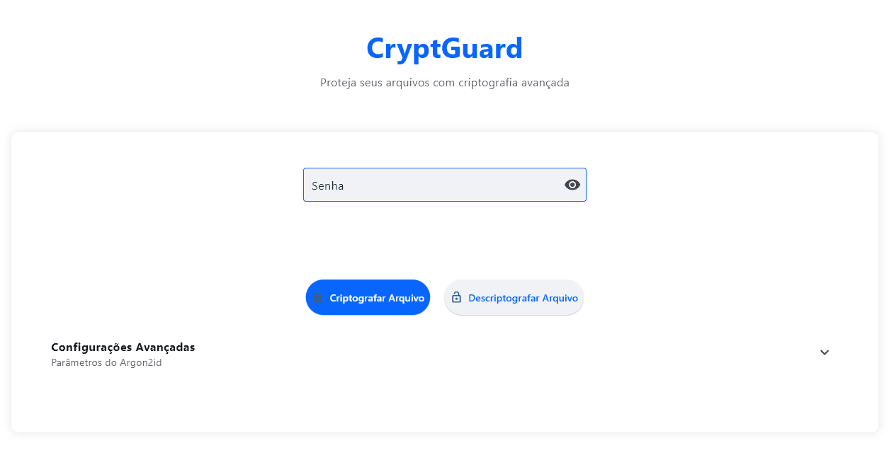

# 🔐 CryptGuard

<div align="center">



[](LICENSE)
[](https://www.python.org/downloads/)
[](SECURITY.md)
[](CONTRIBUTING.md)

**CryptGuard é uma solução avançada de criptografia com interface moderna, focada em segurança e usabilidade.**

[🚀 Começar](#-início-rápido) •
[📖 Documentação](#-documentação) •
[🛡️ Segurança](#%EF%B8%8F-segurança) •
[🤝 Contribuir](#-contribuir) •
[📜 Licença](#-licença)

</div>

## ✨ Características

- 🔒 **Criptografia Robusta**
  - ChaCha20Poly1305 para criptografia autenticada
  - Argon2id para derivação de chaves
  - Reed-Solomon para correção de erros

- 🎯 **Funcionalidades Avançadas**
  - Criptografia de texto e arquivos
  - Suporte a múltiplos arquivos
  - Volumes ocultos com negação plausível
  - Tokens efêmeros para segurança adicional

- 💫 **Interface Moderna**
  - Design inspirado nos apps da Meta
  - Interface responsiva e intuitiva
  - Feedback visual em tempo real
  - Indicador de força de senha

- 🛡️ **Segurança Aprimorada**
  - Verificação de força de senha via zxcvbn
  - Suporte a arquivos-chave
  - Metadados criptografados
  - Proteção contra ataques conhecidos

## 🚀 Início Rápido

### Pré-requisitos

- Python 3.8 ou superior
- pip (gerenciador de pacotes Python)

### Instalação

1. Clone o repositório:
```bash
git clone https://github.com/seu-usuario/cryptguard.git
cd cryptguard
```

2. Instale as dependências:
```bash
pip install -r requirements.txt
```

3. Execute o CryptGuard:
```bash
python cryptguard_ui.py
```

## 💡 Guia de Uso

### Criptografar Arquivo

1. Digite uma senha forte
2. (Opcional) Configure parâmetros avançados do Argon2id
3. Clique em "Criptografar Arquivo"
4. Selecione o arquivo desejado
5. Aguarde a confirmação de sucesso

### Descriptografar Arquivo

1. Digite a senha correta
2. Clique em "Descriptografar Arquivo"
3. Selecione o arquivo .encrypted
4. O arquivo será restaurado com seu nome original

### Volumes Ocultos

1. Prepare dois conjuntos de arquivos (falso e real)
2. Use senhas diferentes para cada volume
3. Guarde o token efêmero gerado
4. Use o token para acessar o volume real

## 📖 Documentação

- [RoadMap](ROADMAP.md) - Funcionalidades e planos futuros
- [Segurança](SECURITY.md) - Guia de segurança e melhores práticas
- [Contribuição](CONTRIBUTING.md) - Como contribuir com o projeto
- [Licença](LICENSE) - Termos de licenciamento

## 🛡️ Segurança

O CryptGuard foi projetado com foco em segurança, mas recomendamos:

- Realizar auditorias independentes
- Seguir as melhores práticas de segurança
- Manter backups dos dados importantes
- Verificar a conformidade legal

Consulte [SECURITY.md](SECURITY.md) para mais informações.

## 🤝 Contribuir

Contribuições são bem-vindas! Por favor, leia nosso [Guia de Contribuição](CONTRIBUTING.md).

### Áreas de Contribuição

- 📝 Documentação
- 🐛 Correção de bugs
- ✨ Novas funcionalidades
- 🎨 Melhorias na interface
- 🌐 Traduções

## 📜 Licença

CryptGuard é licenciado sob a [Licença Apache 2.0](LICENSE).

## 📊 Status do Projeto

- ✅ Interface gráfica moderna
- ✅ Criptografia robusta
- ✅ Documentação completa
- 🚧 Suporte a diretórios
- 🚧 Integração com nuvem
- 🚧 Suporte a YubiKey

## 🙏 Agradecimentos

- Comunidade Python
- Desenvolvedores das bibliotecas utilizadas
- Contribuidores do projeto
- Usuários que reportam bugs e sugerem melhorias

---

<div align="center">

**CryptGuard** - Desenvolvido com ❤️ pela comunidade

[⬆ Voltar ao topo](#-cryptguard)

</div>
